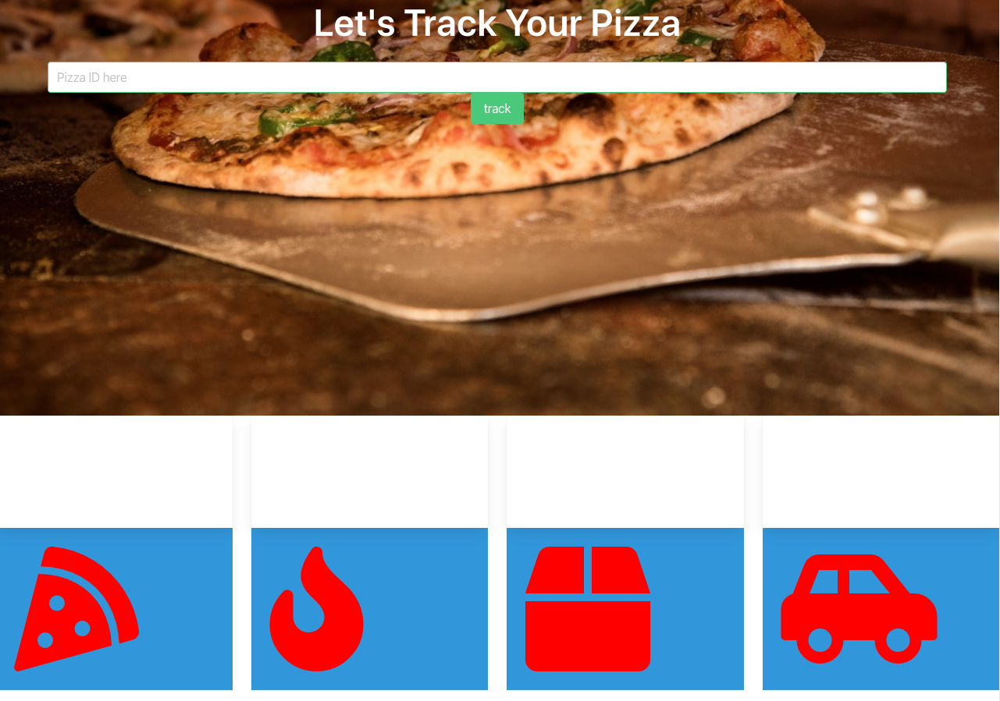
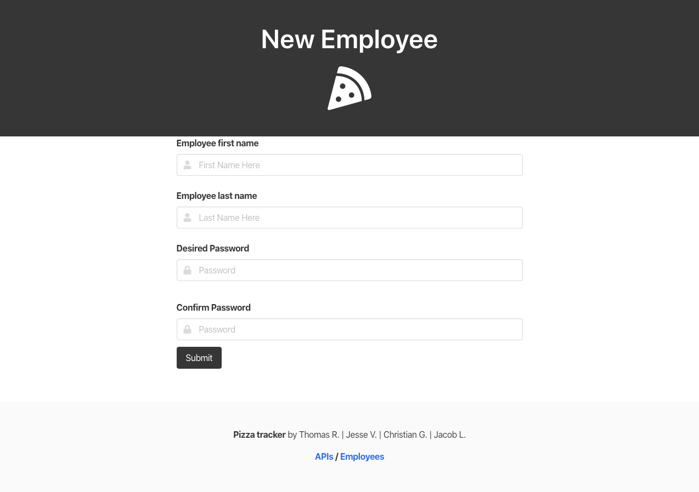
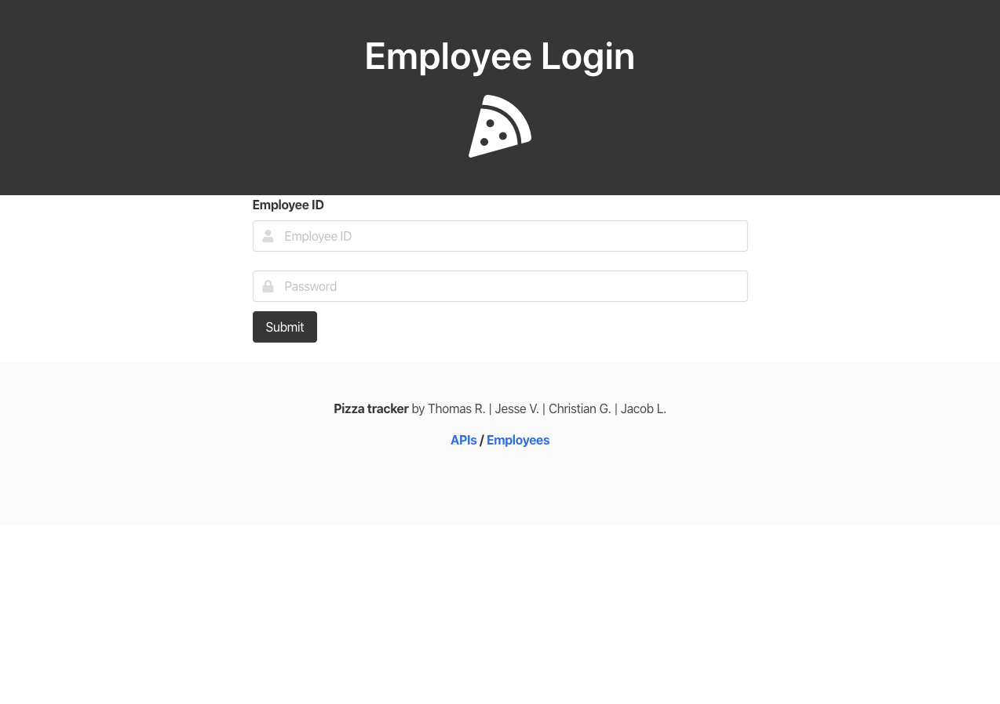

# **Pizza Tracker** 

## Description:
With the piza tracker app, customers are able to build a pizza of their choice form the drop down choices. they can choose a type of crust, cheese, sauce and up to two toppings. There is also a section for customers to type ther special requests and another for their phone number to track the pizza once it is submited. Once the customer has submited the pizza, they can navigte to the tracker page by clicking on the button anfd there they can see where their pizza is during the process. 
in the back end there is a form for employers to add new employees and a sign in page for already created employees. once an eployee logs in, he/she can then review the order and manually modify the step in which the customers pizza is at that moment. Wheter if it has been started, baking, boxing or being delivered. 

## Technology used:
1. Express-handlebars
2. Express
3. Passport
4. Sequelize
5. MySQL2
6. ShortId
7. Bcrypsjs

## User story:
**AS A** _business owner_

**I WANT** _an application in which customers can build their own pizza and employees can update the progress_

**SO THAT** _customers can look up their order and see where in the process there pizza is_

>landing page where customres can create a pizza or navigate to the tracker. Also employes can acces the "employee portal" from here

>tracker page where customers can look up the status of their pizza with their pizza ID

>employers can add a new employee using this form

>employee login form

